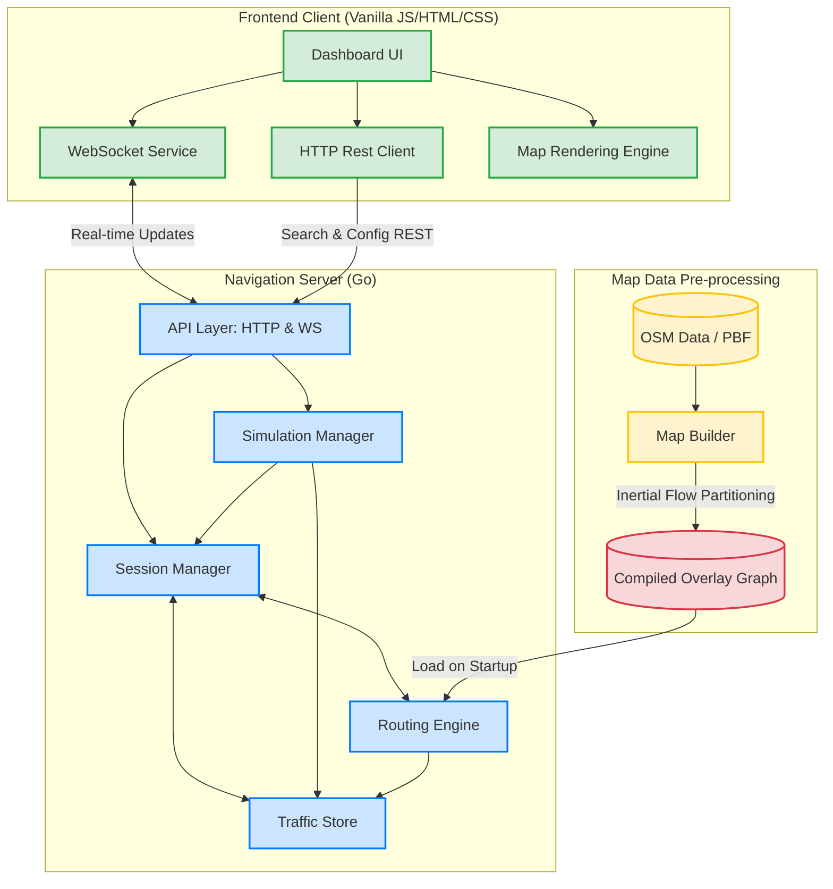
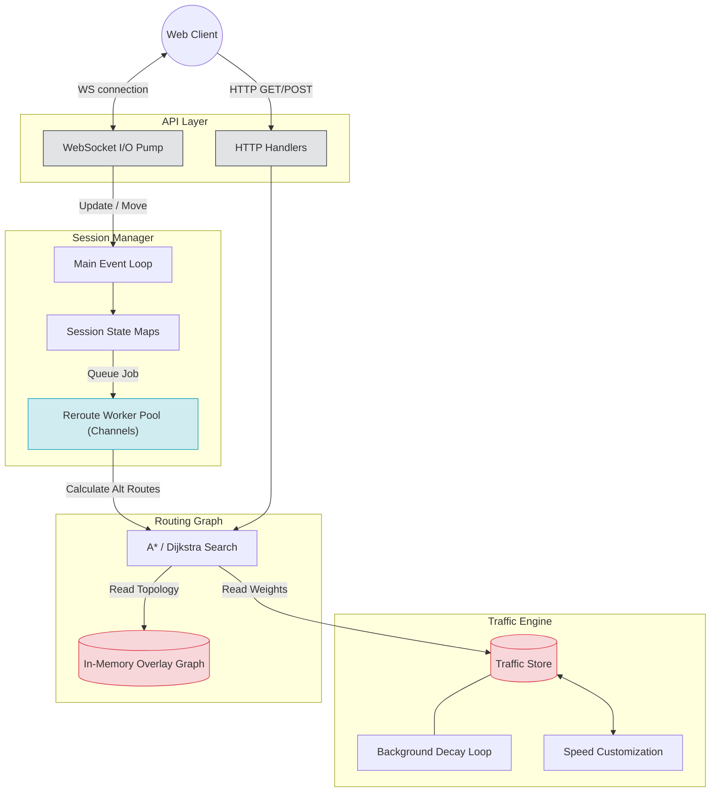
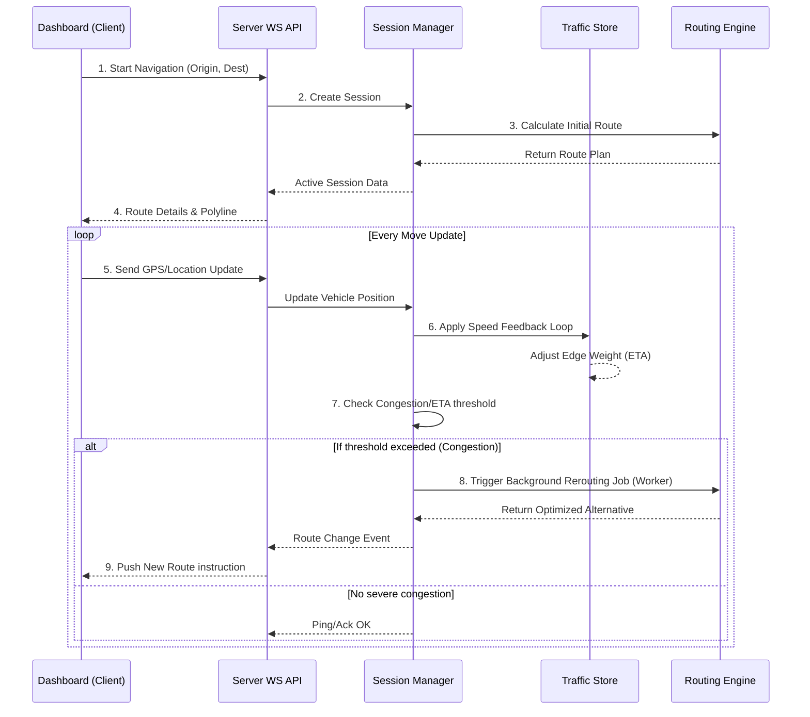

# Parallel-Waze-System-Project

This repository contains the **Parallel Waze System**. Below is a comprehensive visual and structural breakdown of the project architecture, including the components, concurrent architecture, and sequence flows of the application.

## 1. High-Level System Architecture

This diagram shows the top-level communication between the various subsystems that make up the project: the Map Builder (pre-processing), the Navigation Server (Go backend), and the Dashboard Client (Web frontend).

---

## 2. Server Concurrency & Internal Components

The server is designed for high concurrency and low-latency route optimization. This diagram illustrates the Go-specific concurrency patterns utilized, specifically the WebSocket write pools and background worker pools.

### Component Breakdown
* **WebSocket I/O Pump:** A non-blocking architectural pattern designed to handle network I/O smoothly, preventing system-wide latency spikes.
* **Worker Pool:** A pool of Goroutines that pull routing tasks from channels, processing background route optimizations and ETA updates for active drivers concurrently.
* **Traffic Store & Decay Loop:** Holds real-time Edge speed limits/delays. A background loop automatically decays these values over time back to default mapping speeds.
* **In-Memory Overlay Graph:** The primary navigation graph loaded at startup, highly optimized using one-level hierarchical overlay mapping and Inertial Flow partitioning.

---

## 3. Core Flow: Real-Time Driving and Rerouting

Visualizing the system flow when a client connects, drives along a route, and potentially requires dynamic rerouting due to changing traffic conditions.

### Sequence Explanation:
1. **Start Navigation:** The user selects a route on the Dashboard.
2. **Initial Plan:** The `Session Manager` tasks the `Router` to find the initial best path and creates a tracking session.
3. **Move Update Iteration:** The client sends simulated GPS updates over WebSocket as they 'drive'.
4. **Traffic Influence (Feedback Loop):** The server analyzes the user's progressing speed and updates the central `Traffic Store`, potentially altering ETA for other drivers on the same road segment (Edge).
5. **Background Rerouting:** The `Session Manager` constantly evaluates the route. If traffic spikes, a non-blocking `Goroutine` handles calculating a new, faster path dynamically without interrupting the current drive flow.

---

## Summary
The **Parallel Waze System** is split distinctly into static data generation and live real-time interaction. It leverages **Go's strong concurrency features** (Channels, Goroutines) to manage numerous cars, calculate continuous spatial graphs, and distribute data updates via WebSockets down to a responsive Vanilla JS client interface.
