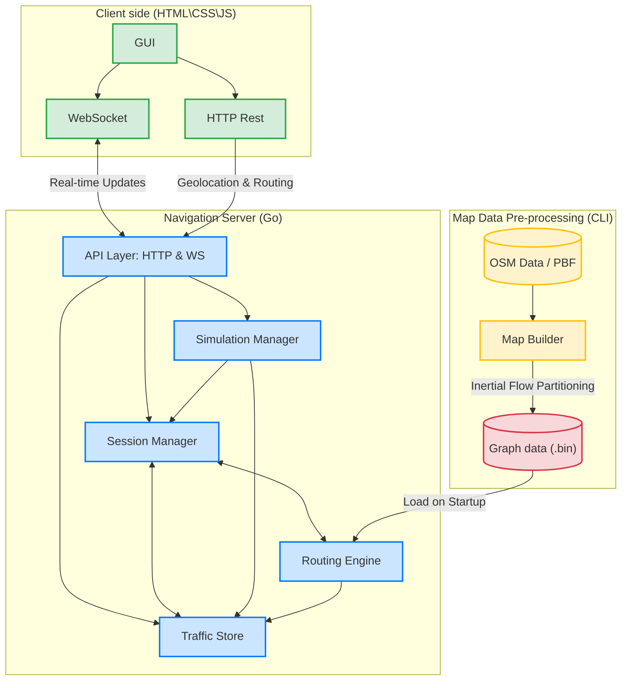

#  Parallel Waze System - Executive Project Presentation

Welcome to the **Parallel Waze System**, a high-performance, real-time navigation and traffic simulation engine built from the ground up. This document is designed as a comprehensive presentation guide, detailing every aspect of the project's architecture, features, and underlying algorithms.

---

## 🌟 1. System Overview
The Parallel Waze System is a custom-built, full-stack navigation platform that simulates a highly active road network. It goes beyond simple point-A to point-B routing by introducing **real-time traffic dynamics, live driver feedback loops, customizable planning, and concurrent background rerouting**. 

**Primary Objective:** To demonstrate advanced backend concurrency, efficient spatial graph algorithms, and real-time bidirectional WebSocket communication in a complex, live environment.

### Key Capabilities:
* **Interactive Navigation Dashboard:** A sleek Web UI allowing users to set routes, observe simulated drivers, and alter global traffic.
* **Intelligent Route Planning:** Calculates the most efficient path utilizing highly optimized mapping data extracted directly from OpenStreetMap (OSM).
* **Live Traffic Propagation:** As cars "drive" through the simulation, their real-time speeds dynamically alter the "weight" (ETA) of the roads they use, propagating traffic jams across the network organically.
* **Proactive Dynamic Rerouting:** The engine constantly monitors active drivers against live traffic data. If a route becomes congested, a background process finds a faster alternative and silently pushes a new path.

---

## 🧠 2. Algorithmic Deep Dive & Traffic Management

The core of the system relies on executing high-speed graph traversals against a continuously shifting data architecture. Modern navigation systems like Waze must handle massive amounts of users at the same time, making standard algorithms like Dijkstra's or A* way too slow, which is why modern techniques rely on map preprocessing to enable quick queries at runtime.

### A. Graph Partitioning: Inertial Flow Recursive Bisection
To create an optimized map hierarchy, the Map Builder engine uses the Inertial Flow Recursive Bisection algorithm to divide the map into roughly equal sized cells, minimizing the number of cross edges connecting them.
* The algorithm bisects the graph into two halves with a random-angled line, and projects nodes onto it.
* We group nodes that fall in the two extremes, set them as super-source and super-sink.
* It then runs Dinic's Min-cut\Max-flow algorithm (BFS level-graphs + DFS flow augmentations) to partition the graph by the fewest amount of crossing edges.
* We recursively divide the resulting subgraphs in parallel until the cells match our desired dimensions, resulting in a minimal sized overlay graph.

### B. The Overlay Graph Architecture
The engine solves real-time routing using Customizable Route Planning (CRP), which separates the map structure (topology) and the dynamic costs (metric). The system constructs a base graph and a minimal Overlay Graph consisting of these three components:
* **Gate Nodes:** Boundary Nodes with at least one edge going outside their cell.
* **Cross Cell Edges:** Road segments connecting gates of two different cells.
* **Shortcut Edges:** Logical edges connecting every gate node to every gate node within the same cell, creating a clique. The weight of the shortcut is set to the weight of the shortest route inside the cell.
The overlay graph omits all inter cell nodes and edges, making it much smaller.

### C. Two-Level Routing Algorithm (CRP)
When finding the shortest route between source (s) and target (t) coordinates, a Two-Level Search is executed on the base and overlay graphs:
1. **Initialization:** Find the closest node to s (sign it as s') and the closest node to t (sign it as t'). Identify the cell containing s' (Cell A) and the cell containing t' (Cell B).
2. **Source Cell Search:** Run Dijkstra inside cell A to find the shortest distance from s' to every gate of cell A.
3. **Overlay Leap:** Once on the gates of Cell A, hop onto the overlay graph. Using the distances from the first Dijkstra as starting costs, execute A* with the gates of cell B as destinations.
4. **Target Cell Search:** Once on the bounds of Cell B, hop back into the base graph and run Dijkstra inside cell B to find the shortest path from the gates to t'.
5. **Path Unpacking:** The naive approach is to store the full path for every shortcut edge, but this is very memory wasteful. Instead, the engine dynamically unpacks the route by running a quick Dijkstra inside the edge's cell to retrieve the path. Since the cells are small, it barely affects the runtime.

### D. The Customization Phase (Live Traffic)
In a dynamic system, the base edge's weight changes all the time. Since CRP decouples the graph's metric and topology, all we need to do is update the weights of the overlay edges.
* The system calculates new shortcut edge weights by running a Dijkstra from every gate node inside its cell, and the calculations are all independent and calculated in parallel.
* As an optimization, the system only recomputes weights for cells with at least one base edge whose weight has changed since the last customization phase. Since cells are small, calculating the weights of all the edges in the cell is faster than filtering only the edges that have been affected.
* Shortcut edge weights for a cell are kept in a matrix of size d x d (d is the number of gates in the cell), so updating weights is simply updating the values of this matrix.

### E. Real-Time Optimizations
* **Admissible Heuristics:** To assist the A* approach natively on the Overlay Graph, the algorithm references an Admissible Heuristic equation calculating Euclidean geometric distance divided by maxSearch SpeedMps. A safe lower-bound heuristic guides the algorithm towards the target without over-analyzing trailing edge trees.
* **Local Route Patching:** Recalculating a complete global A* path across the entire overlay graph every time a major highway boundary gets congested can be computationally expensive. If a crossover edge (Edge A) experiences a large increase in traffic, the system halts the global recalculation and runs a bounded, "mini-Dijkstra" localized search exclusively between the two boundary nodes defining Edge A. If the newly patched local detour resolves the traffic spike within an acceptable threshold, the system patches the original route without ever triggering an expensive global Overlay Graph sweep.

### F. Data Structures: Compressed Sparse Row (CSR)
The system utilizes Compressed Sparse Row (CSR) storage for memory efficiency and cache friendly adjacency lookups. Both the base and the overlay graph are represented in CSR format using two main arrays:
* **Nodes Array:** A single array containing all nodes sorted by their source node.
* **Edges Array:** A single array containing all edges (or IDs) sorted by their source node.
* **Offsets Array:** An array where Offsets[i] points to the index in the Edges array where Node i's outgoing edges begin.
* **ID Mapping:** Instant mapping translates OSM ID to Node Index and OSM ID to Gate Index. This allows the routing engine to "hop" from the base graph directly into the correct entry point of the overlay graph.
---

## 🏗️ 3. System Architecture & Concurrency

The backend, written entirely in **Go**, leverages Go's strong concurrency features (channels and goroutines) to handle massive parallelization.

### High-Level Components
This logical overview demonstrates how the Vanilla JS Client interacts with the Go server, and how the Go server utilizes pre-processed OSM graph data.



### The Worker Pool & Non-Blocking Design
Routing algorithms are computationally heavy. If the main server thread halted to calculate a new route every time a car hit traffic, the system would freeze. 
* We solve this by dropping reroute requests into a **Channel**, which a dedicated pool of **Reroute Workers (Goroutines)** picks up, processes in the background, and seamlessly pushes back to the active session.
* We utilize a **WebSocket I/O Pump**, a non-blocking pattern designed to handle relentless, high-frequency GPS coordinate updates over WS, preventing system-wide latency spikes.

---

## 🚀 4. How to Run

Launching the entire system (Building the map, compiling the server, and serving the client) is fully automated.

### Prerequisites:
* **Go** installed and added to `PATH`.
* **Python 3** installed and added to `PATH` (used for the simple static HTTP server).
* **Map Data:** Use the built-in region picker to choose or download a region under `server\data\map\`.

### Execution:
1. Simply double-click the `run.cmd` file in the root directory, or execute it from the command line:
   ```cmd
   .\run.cmd
   ```
2. **What the script does:**
   * Validates Go and Python installations.
   * Compiles the Go server and region-picker executables inside `.cache/bin/`.
   * Opens the region picker so you can choose an already-built region or download and build a new one.
   * Starts the Go API (`:8080`) and the static client server (`:3000`) in new command windows.
   * Opens your default web browser to `http://localhost:3000/navigation.html`.
