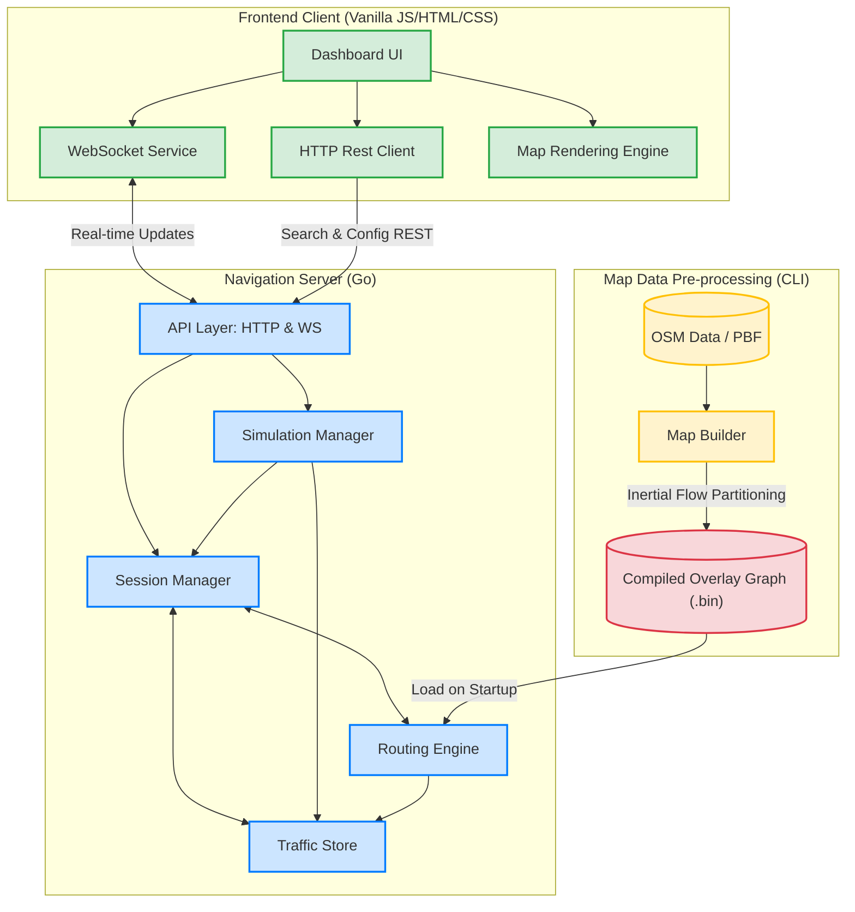
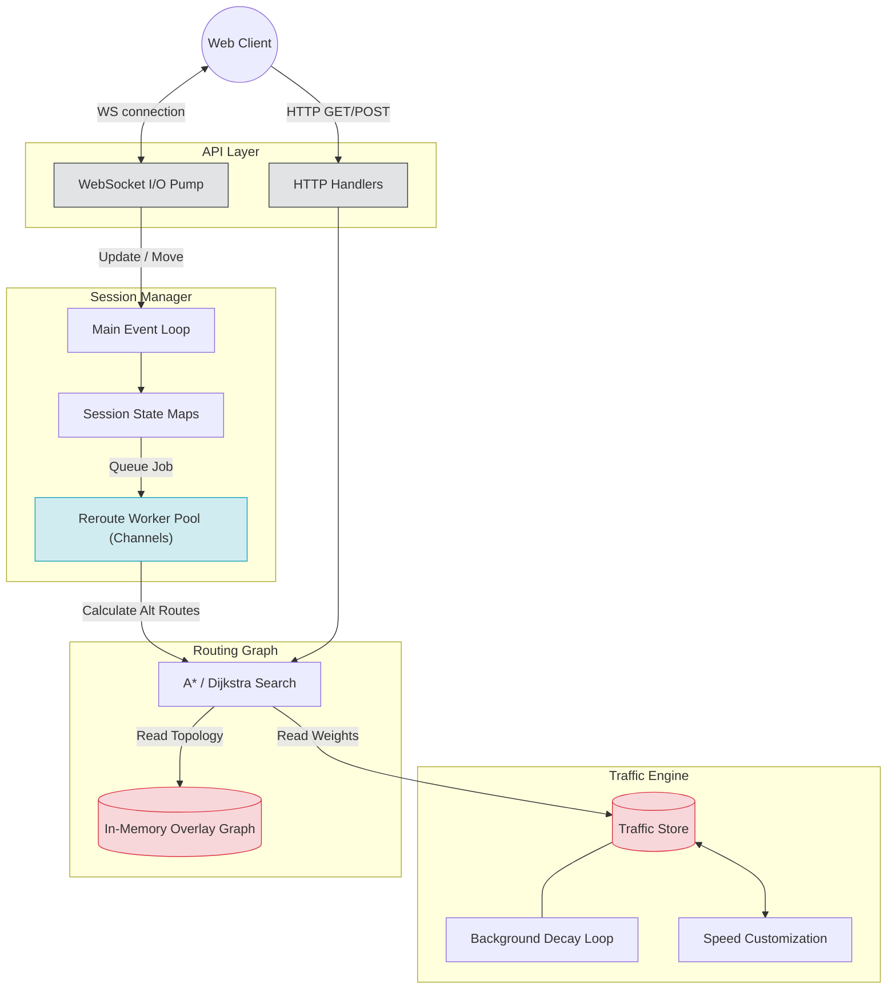
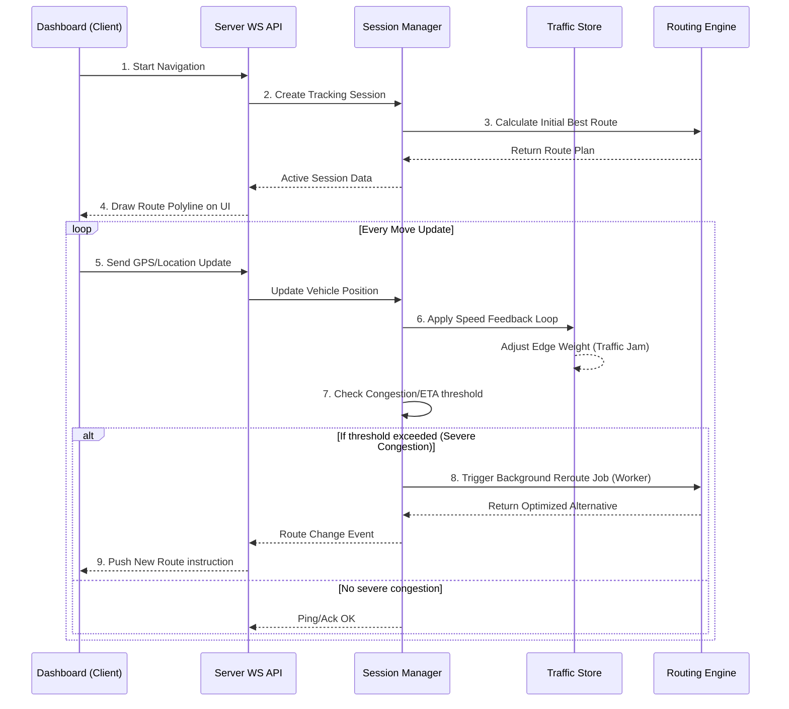

# 🚗 Parallel Waze System - Executive Project Presentation

Welcome to the **Parallel Waze System**, a high-performance, real-time navigation and traffic simulation engine built from the ground up. This document is designed as a comprehensive presentation guide, detailing every aspect of the project's architecture, features, and underlying algorithms.

---

## 🌟 1. Executive Summary
The Parallel Waze System is a custom-built, full-stack navigation platform that simulates a highly active road network. It goes beyond simple point-A to point-B routing by introducing **real-time traffic dynamics, live driver feedback loops, and concurrent background rerouting**. 

**Primary Objective:** To demonstrate advanced backend concurrency, efficient spatial graph algorithms, and real-time bidirectional WebSocket communication in a complex, live environment.

### 🎯 Key Features:
* **Real-time Map Rendering & Navigation:** A sleek Vanilla JS/HTML frontend displaying an interactive map and live driving dashboard.
* **Intelligent Route Planning:** Calculates the most efficient path utilizing highly optimized mapping data extracted directly from OpenStreetMap (OSM).
* **Live Traffic & Speed Feedback Loop:** As cars "drive" through the simulation, their speeds dynamically alter the "weight" (ETA) of the roads they use, propagating traffic jams across the network.
* **Dynamic Rerouting:** The engine constantly monitors active drivers; if traffic on their current route exceeds a threshold, a background process finds a faster alternative and updates them on-the-fly without interrupting their journey.
* **High-Concurrency Architecture:** Written entirely in Go, the server utilizes worker pools and non-blocking I/O to manage countless parallel simulation states without latency spikes.

---

## 🏗️ 2. System Architecture

The project is distinctly split into **Static Data Preparation** (Map Builder) and the **Live Real-time Environment** (Frontend UI + Go Server).

### High-Level Architecture
This logical overview demonstrates how the Vanilla JS Client interacts with the Go server, and how the Go server utilizes pre-processed OSM graph data.



---

## ⚙️ 3. Backend Deep Dive: The Go Engine

The server (`/server`) is the powerhouse of the system. Designed in Go, it heavily leverages Goroutines and Channels to achieve massive parallelization.

### Concurrent Architecture Breakdown
This diagram perfectly illustrates our solution to handling thousands of concurrent WebSocket updates alongside heavy Dijkstra/A* graph calculations.



### Key Backend Components:
* **The Worker Pool & Channels:** Routing algorithms are computationally heavy. If the main server thread halted to calculate a new route every time a car hit traffic, the system would freeze. We solve this by dropping reroute requests into a **Channel**, which a dedicated pool of **Reroute Workers (Goroutines)** picks up, processes in the background, and seamlessly pushes back to the active session.
* **WebSocket I/O Pump:** A non-blocking architectural pattern designed to handle relentless, high-frequency GPS coordinate updates over WS, preventing system-wide latency spikes.
* **The Map Builder (Pre-processor):** Parses raw `.osm.pbf` files. We utilize **Inertial Flow Partitioning** to divide the massive map into manageable geographical cells, allowing the server to load a highly optimized one-level hierarchical overlay graph on startup instantly.

---

## 🚗 4. Core Flow: Real-Time Traffic & Dynamic Rerouting

The true "Waze" experience comes from our living traffic environment. Here is exactly what happens when a car starts driving:



### The Traffic Feedback Loop Explained:
1. **The Edge:** Every road segment in the graph is an "Edge" with a base speed limit and length.
2. **Speed Customization:** Through the dashboard, users can alter the speed of cars.
3. **The Feedback:** As a car moves slowly across an edge, the server tracks its velocity. It updates the central `Traffic Store`, explicitly raising the "Weight" (estimated time to cross) of that specific road.
4. **The Decay:** Traffic doesn't last forever. A `Background Decay Loop` constantly scrubs the `Traffic Store`, slowly lowering the artificial weights back down to their default, empty-road speeds over time.
5. **The Reroute Event:** As edge weights increase in the store, the `Session Manager` detects that an active driver's ETA has spiked. It asks the `Router` to check for alternatives. If a different path is faster, the system sends an update to the Client to change directions instantly.

---

## 💻 5. Frontend Deep Dive: The Dashboard

The UI (`/client`) is intentionally built with pure **Vanilla JavaScript, HTML, and CSS**, demonstrating fundamental DOM manipulation and direct WebSocket handling without the overhead of heavy frameworks. 

* **Collapsible UI:** A professional, responsive sidebar contains search capabilities, active car monitoring, and route information arrays.
* **Live Render Engine:** The map elements respond instantly to WebSocket events, dynamically drawing tracking lines, animating cars along polyline routes, and displaying active simulated driver statuses.

---

## 🚀 6. Getting Started / How to Run

Launching the entire system (Building the map, compiling the server, and serving the client) is fully automated.

### Prerequisites:
* **Go** installed and added to `PATH`.
* **Python 3** installed and added to `PATH` (used for the simple static HTTP server).
* **Map Data:** You must have the OpenStreetMap data packet (`israel-latest.osm.pbf`) located in `server\data\map\`.

### Execution:
1. Simply double-click the `run.cmd` file in the root directory, or execute it from the command line:
   ```cmd
   .\run.cmd
   ```
2. **What the script does:**
   * Validates Go and Python installations.
   * Checks if compiled `.bin` map files exist. If not, it natively runs the Map Builder to crunch the `.pbf` file.
   * Compiles the Go Server to an executable inside incredibly fast `.cache/bin/`.
   * Pops open two new command windows: One running the Go API (`:8080`) and one running the Python Static File Server (`:3000`).
   * Automatically opens your default web browser to `http://localhost:3000/navigation.html`.

Enjoy presenting the **Parallel Waze System**!
