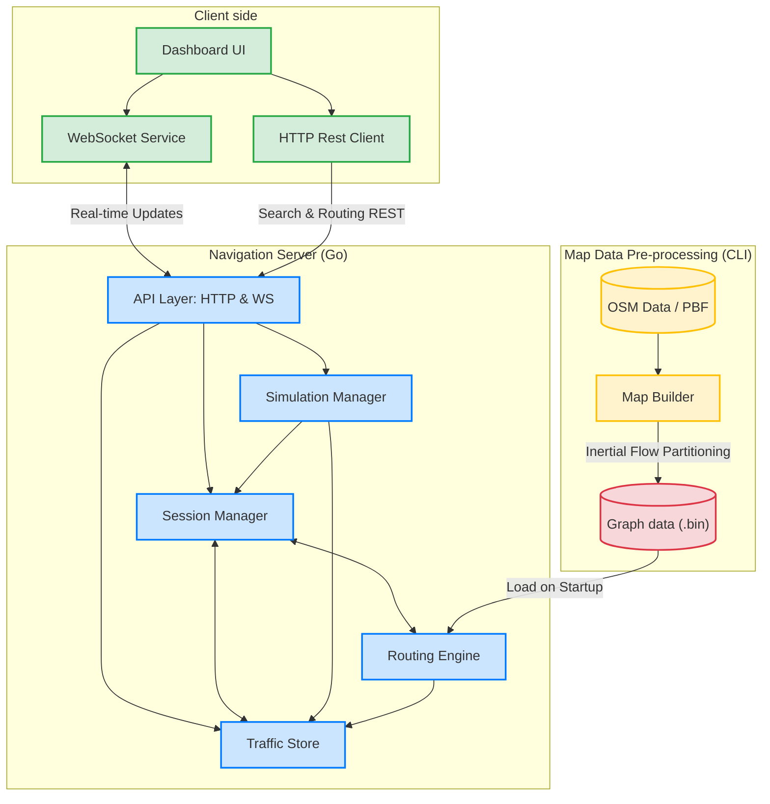

# 🚗 Parallel Waze System - Executive Project Presentation

Welcome to the **Parallel Waze System**, a high-performance, real-time navigation and traffic simulation engine built from the ground up. This document is designed as a comprehensive presentation guide, detailing every aspect of the project's architecture, features, and underlying algorithms.

---

## 🌟 1. System Overview: What the System Does
The Parallel Waze System is a custom-built, full-stack navigation platform that simulates a highly active road network. It goes beyond simple point-A to point-B routing by introducing **real-time traffic dynamics, live driver feedback loops, customizable planning, and concurrent background rerouting**. 

**Primary Objective:** To demonstrate advanced backend concurrency, efficient spatial graph algorithms, and real-time bidirectional WebSocket communication in a complex, live environment.

### 🎯 Key Capabilities:
* **Interactive Navigation Dashboard:** A sleek Web UI allowing users to set routes, observe simulated drivers, and alter global traffic.
* **Intelligent Route Planning:** Calculates the most efficient path utilizing highly optimized mapping data extracted directly from OpenStreetMap (OSM).
* **Live Traffic Propagation:** As cars "drive" through the simulation, their real-time speeds dynamically alter the "weight" (ETA) of the roads they use, propagating traffic jams across the network organically.
* **Proactive Dynamic Rerouting:** The engine constantly monitors active drivers against live traffic data. If a route becomes congested, a background process finds a faster alternative and silently pushes a new path.

---

## 🧠 2. Algorithmic Deep Dive & Traffic Management

The core of the system relies on executing high-speed graph traversals against a continuously shifting data architecture. 

### A. Graph Construction & Inertial Flow Partitioning
Running raw routing queries on millions of OpenStreetMap nodes is too slow for real-time, interactive navigation. We solved this during the pre-processing phase.
1. The Map Builder parses raw `.osm.pbf` files into a network of Nodes and Edges.
2. We utilize an algorithm inspired by **Inertial Flow Partitioning** to divide the massive map into manageable geographical "cells".
3. Any road (Edge) that crosses a cell boundary is promoted to the **Overlay Graph**. 
4. **The Result:** A highly optimized one-level hierarchical overlay graph. The system can instantly calculate routes across the country by traversing local base-graph cells only at the origin and destination, leaping across the high-speed Overlay Graph for the vast majority of the journey.

### B. Customizable Route Planning (Dynamic A* / Dijkstra)
When a driver requests a path, the `Routing Engine` invokes an A* or Dijkstra-based search algorithms. 
* The crux of the algorithm is the **Edge Weight Function**: `Estimated Time = Distance / Speed`.
* The `Speed` is not static. While it starts as the legal speed limit of the road, the algorithm actively requests the *current* speed multiplier from the concurrent `Traffic Store`. 
* This customizable approach means the algorithm naturally pivots away from congested avenues directly toward faster neighborhood streets, as the literal mathematical cost of using main roads spikes.

### C. Live Speed Feedback Loop & Traffic Propagation
The "Waze" experience comes from our living traffic environment. 
1. **Feedback Loop:** As a simulated car moves slowly across an edge, the server tracks its velocity. If it drops below the road's current ETA (e.g., 10km/h in a 50km/h zone), the simulation recognizes heavy congestion and lowers the global `Speed` value of that edge in the `Traffic Store`.
2. **Instant Impact:** Any new route calculation instantly incorporates this penalty, automatically diverting new cars.
3. **The Decay Loop:** Traffic doesn't last forever. A concurrent `Background Decay Loop` constantly scrubs the `Traffic Store`, slowly increasing the speed of traffic-heavy roads back to their default, empty-road state mathematically over time. This prevents permanent phantom traffic jams.

### D. Concurrent Background Rerouting Algorithm
We don't just route you once; we constantly protect your ETA.
1. When a user gets a route, their `Session Manager` constantly watches the `Traffic Store`.
2. If an edge on their pending polyline suffers a traffic hit, the Session recognizes the ETA inflation.
3. It fires an async request into a **Worker Pool** to check for an alternative route from their exact current coordinate. 
4. **Hysteresis Threshold:** The worker finds the *new* optimal route. If the new ETA is significantly better than the old affected ETA (beyond a threshold, e.g., saves > 2 minutes), the server accepts it. This threshold prevents volatile "route-flapping" (changing routes constantly for purely minor gains).
5. The system pushes the new path to the client via WebSockets perfectly seamlessly without disrupting the ongoing drive.

---

## 🏗️ 3. System Architecture & Concurrency

The backend, written entirely in **Go**, leverages Go's strong concurrency features (channels and goroutines) to handle massive parallelization.

### High-Level Components
This logical overview demonstrates how the Vanilla JS Client interacts with the Go server, and how the Go server utilizes pre-processed OSM graph data.



### The Worker Pool & Non-Blocking Design
Routing algorithms are computationally heavy. If the main server thread halted to calculate a new route every time a car hit traffic, the system would freeze. 
* We solve this by dropping reroute requests into a **Channel**, which a dedicated pool of **Reroute Workers (Goroutines)** picks up, processes in the background, and seamlessly pushes back to the active session.
* We utilize a **WebSocket I/O Pump**, a non-blocking pattern designed to handle relentless, high-frequency GPS coordinate updates over WS, preventing system-wide latency spikes.

---

## 🚀 4. Getting Started / How to Run

Launching the entire system (Building the map, compiling the server, and serving the client) is fully automated.

### Prerequisites:
* **Go** installed and added to `PATH`.
* **Python 3** installed and added to `PATH` (used for the simple static HTTP server).
* **Map Data:** You must have the OpenStreetMap data packet (`israel-latest.osm.pbf`) located in `server\data\map\`.

### Execution:
1. Simply double-click the `run.cmd` file in the root directory, or execute it from the command line:
   ```cmd
   .\run.cmd
   ```
2. **What the script does:**
   * Validates Go and Python installations.
   * Checks if compiled `.bin` map files exist. If not, it natively runs the Map Builder to crunch the `.pbf` file.
   * Compiles the Go Server to an executable inside incrementally fast `.cache/bin/`.
   * Pops open two new command windows: One running the Go API (`:8080`) and one running the Python Static File Server (`:3000`).
   * Automatically opens your default web browser to `http://localhost:3000/navigation.html`.
